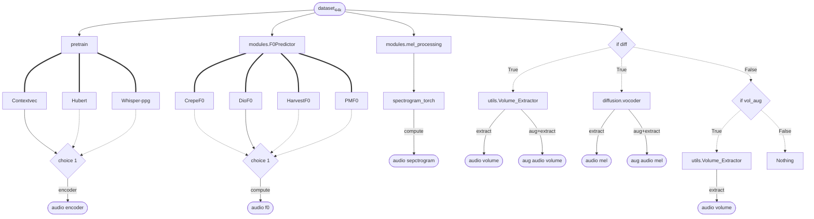
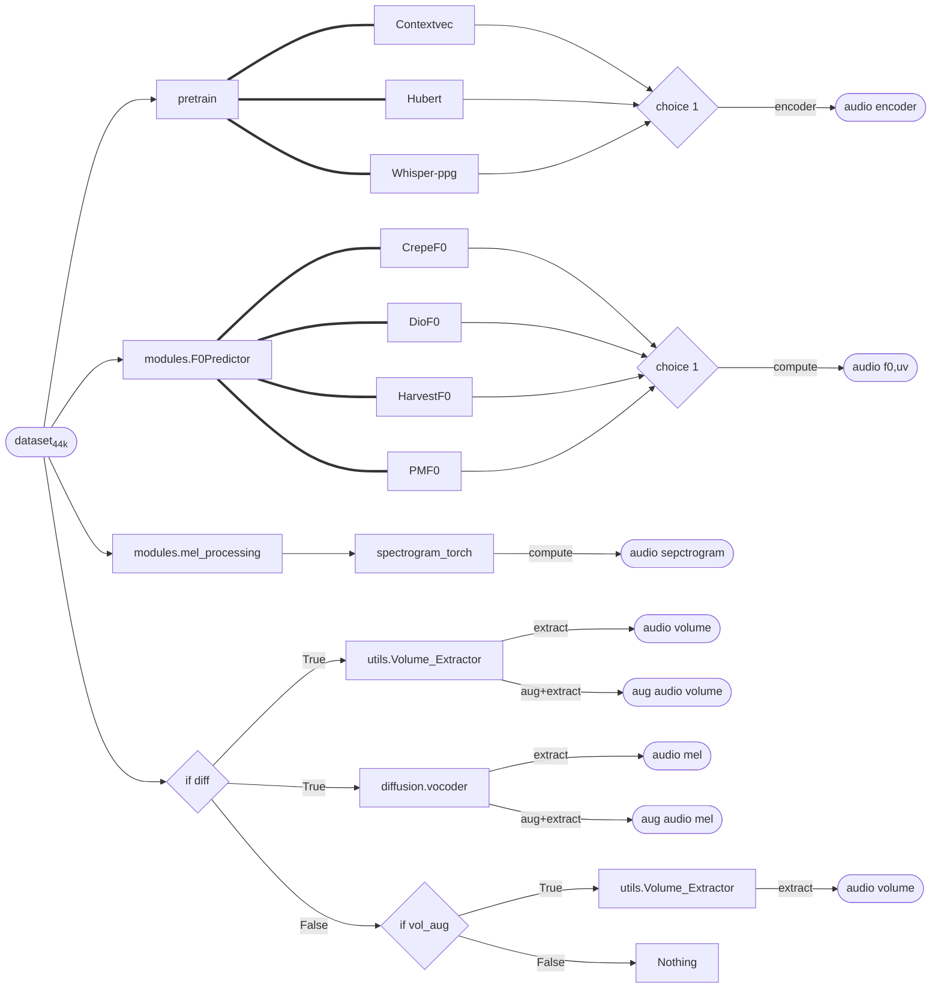
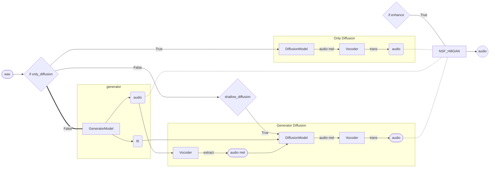
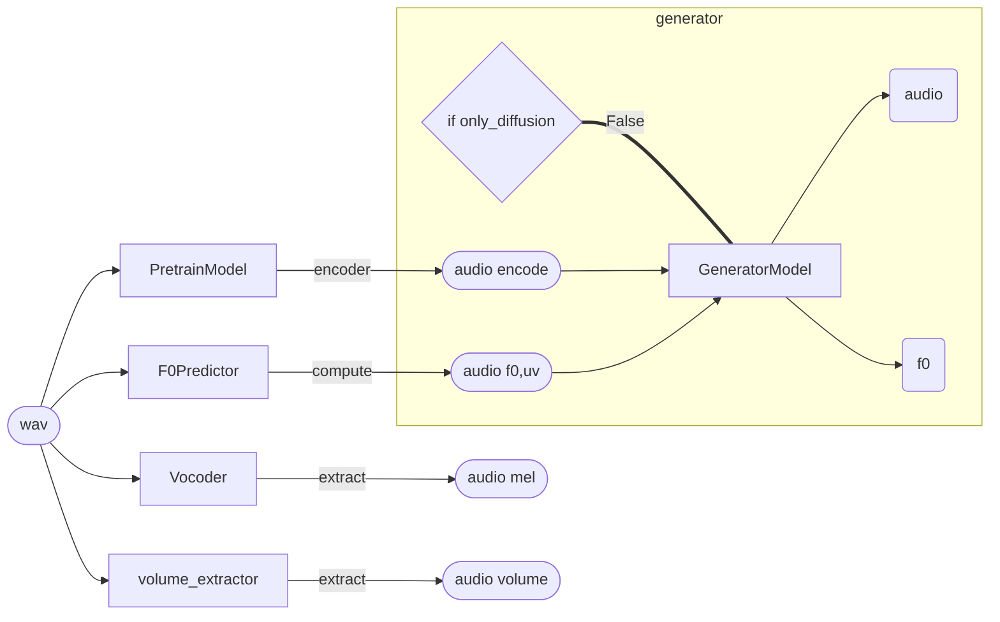
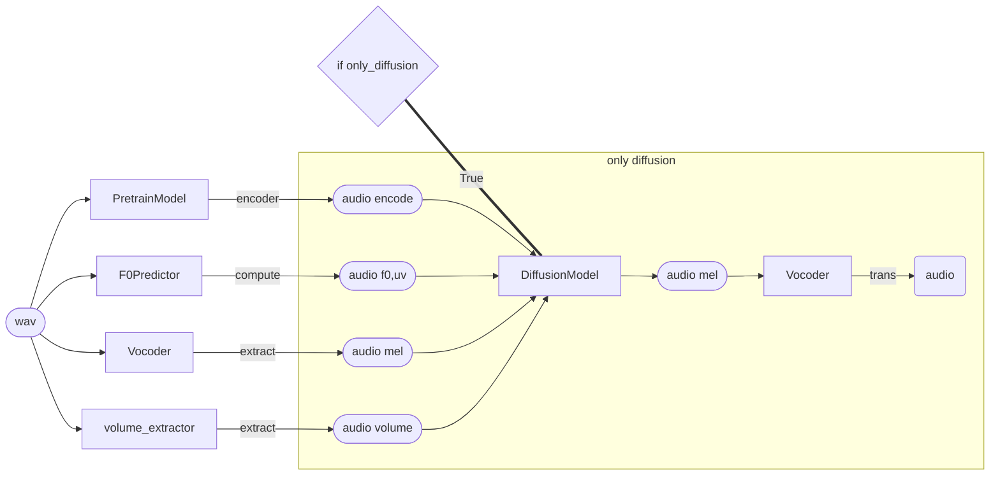
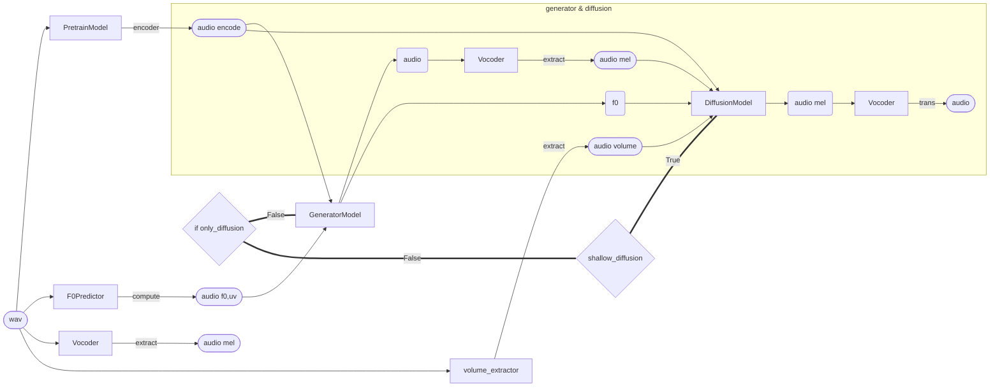
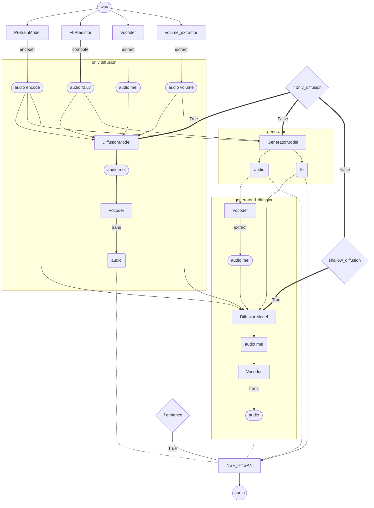

# SO-VITs-SVC

```mermaid
flowchart LR
data([Audio:wav])-->|slice|data_slices([data slices])-->|resample|data_slices2([data slices<sub>44k</sub>])
data_slices2-->|save|dataset([dataset<sub>44k</sub>])
```

 Audio Feature Extract

#### Graph

```mermaid
graph TD
dataset([dataset<sub>44k</sub>])-->Pretrain[pretrain]===Contextvec-->choice{choice 1}
Pretrain===Hubert-.->choice
Pretrain===Whisper-ppg-.->choice
choice-->|encoder|audio_x([audio encoder])
dataset-->F0Predictor[modules.F0Predictor]===CrepeF0-.->choice2{choice 1}
F0Predictor===DioF0-->choice2
F0Predictor===HarvestF0-.->choice2
F0Predictor===PMF0-.->choice2-->|compute|audio_f0([audio f0])
dataset-->MelProcess[modules.mel_processing]-->spectrogram_torch-->|compute|audio_spec([audio sepctrogram])
dataset-->choice3{if diff}-.->|True|Volume_Extractor[utils.Volume_Extractor]-->|extract|audio_volume([audio volume])
Volume_Extractor-->|aug+extract|aug_audio_volume([aug audio volume])
choice3-.->|True|vocoder[diffusion.vocoder]-->|extract|audio_mel([audio mel])
vocoder-->|aug+extract|aug_audio_mel([aug audio mel])
choice3-.->|False|choice4{if vol_aug}-.->|True|Volume_Extractor1[utils.Volume_Extractor]-->|extract|audio_volume1([audio volume])
choice4-.->|False|Nothing
```
#### FLowchart

```mermaid
flowchart LR
dataset([dataset<sub>44k</sub>])-->Pretrain[pretrain]===Contextvec-->choice{choice 1}
Pretrain===Hubert-->choice
Pretrain===Whisper-ppg-->choice
choice-->|encoder|audio_x([audio encoder])
dataset-->F0Predictor[modules.F0Predictor]===CrepeF0-->choice2{choice 1}
F0Predictor===DioF0-->choice2
F0Predictor===HarvestF0-->choice2
F0Predictor===PMF0-->choice2-->|compute|audio_f0([audio f0,uv])
dataset-->MelProcess[modules.mel_processing]-->spectrogram_torch-->|compute|audio_spec([audio sepctrogram])
dataset-->choice3{if diff}-->|True|Volume_Extractor[utils.Volume_Extractor]-->|extract|audio_volume([audio volume])
Volume_Extractor-->|aug+extract|aug_audio_volume([aug audio volume])
choice3-->|True|vocoder[diffusion.vocoder]-->|extract|audio_mel([audio mel])
vocoder-->|aug+extract|aug_audio_mel([aug audio mel])
choice3-->|False|choice4{if vol_aug}-->|True|Volume_Extractor1[utils.Volume_Extractor]-->|extract|audio_volume1([audio volume])
choice4-->|False|Nothing
```

#### Inference

```mermaid
graph LR

cond1{if only_diffusion}
x([wav])-->cond1
cond1-->|True|DiffusionModel
subgraph Only Diffusion
DiffusionModel-->|audio mel|v[Vocoder]-->|trans|audio(audio)
end
cond1===|False|G[GeneratorModel]
subgraph generator
G-->audio2(audio)
G-->f0(f0)
end
cond1-->|False|cond2{shallow_diffusion}-->|True|D[DiffusionModel]
subgraph Generator  Diffusion
f0-->D
audio2-->v2[Vocoder]-->|extract|m3([audio mel])-->D
D-->|audio mel|v3[Vocoder]-->|trans|audio3([audio])
end
cond3{if enhance}---|True|Gan[NSF_HifiGAN]
audio-.-Gan
audio2-.-Gan
audio3-.-Gan-->af((audio))
```

- Generator

```mermaid
flowchart LR
x([wav])-->PretrainModel-->|encoder|c([audio encode])
x([wav])-->F0Predictor-->|compute|f([audio f0,uv])
x([wav])-->Vocoder-->|extract|m([audio mel])
x([wav])-->volume_extractor-->|extract|audio_vol([audio volume])
 
cond1{if only_diffusion}
subgraph generator
cond1===|False|G[GeneratorModel]
c-->G;f-->G-->audio2(audio)
G-->f0(f0)
end
 
```

- Diffusion

```mermaid
flowchart LR
x([wav])-->PretrainModel-->|encoder|c([audio encode])
x([wav])-->F0Predictor-->|compute|f([audio f0,uv])
x([wav])-->Vocoder-->|extract|m([audio mel])
x([wav])-->volume_extractor-->|extract|audio_vol([audio volume])
 
cond1{if only_diffusion}===|True|DiffusionModel
subgraph only diffusion
c-->DiffusionModel
f-->DiffusionModel
m-->DiffusionModel
audio_vol-->DiffusionModel-->m2([audio mel])-->v[Vocoder]-->|trans|audio(audio)
end
 
```

- Generator&Diffusion

```mermaid
flowchart LR
x([wav])-->PretrainModel-->|encoder|c([audio encode])
x([wav])-->F0Predictor-->|compute|f([audio f0,uv])
x([wav])-->Vocoder-->|extract|m([audio mel])
x([wav])-->volume_extractor-->|extract|audio_vol([audio volume])
 
cond1{if only_diffusion} 
cond1===|False|G[GeneratorModel]
 
c-->G;f-->G-->audio2(audio)
G-->f0(f0)
 
cond1===|False|cond2{shallow_diffusion}===|True|D[DiffusionModel]
subgraph generator & diffusion
audio2-->v2[Vocoder]-->|extract|m3([audio mel])
c-->D[DiffusionModel]
f0-->D;m3-->D;audio_vol-->D-->m4(audio mel)-->v3[Vocoder]-->|trans|audio3([audio])
end
 
```

##### Allover

```mermaid
flowchart TB
x([wav])-->PretrainModel-->|encoder|c([audio encode])
x([wav])-->F0Predictor-->|compute|f([audio f0,uv])
x([wav])-->Vocoder-->|extract|m([audio mel])
x([wav])-->volume_extractor-->|extract|audio_vol([audio volume])
 
cond1{if only_diffusion}===|True|DiffusionModel
subgraph only diffusion
c-->DiffusionModel
f-->DiffusionModel
m-->DiffusionModel
audio_vol-->DiffusionModel-->m2([audio mel])-->v[Vocoder]-->|trans|audio(audio)
end
cond1===|False|G[GeneratorModel]
subgraph generator
c-->G;f-->G-->audio2(audio)
G-->f0(f0)
end
cond1===|False|cond2{shallow_diffusion}===|True|D[DiffusionModel]
subgraph generator & diffusion
audio2-->v2[Vocoder]-->|extract|m3([audio mel])
c-->D[DiffusionModel]
f0-->D;m3-->D;audio_vol-->D-->m4(audio mel)-->v3[Vocoder]-->|trans|audio3([audio])
end
cond3{if enhance}---|True|Gan[NSF_HifiGAN]
audio-.-Gan
audio2-.-Gan
audio3-.-Gan
f0-->Gan-->af((audio))
```

